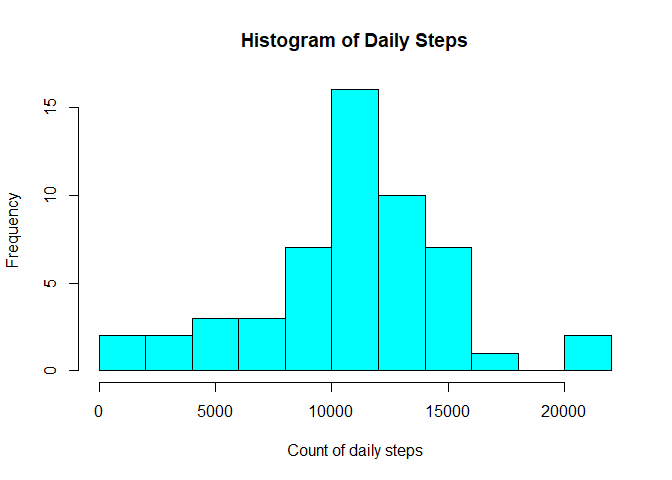
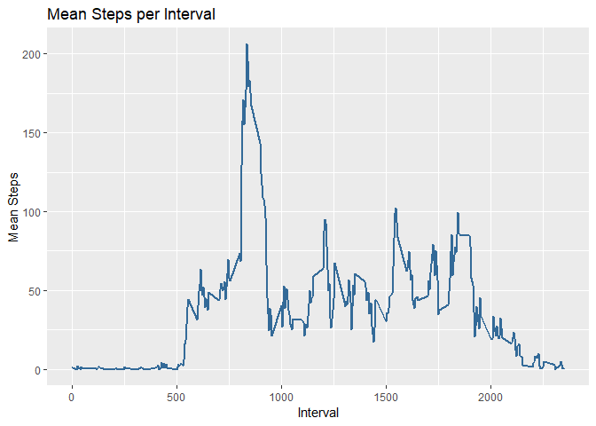
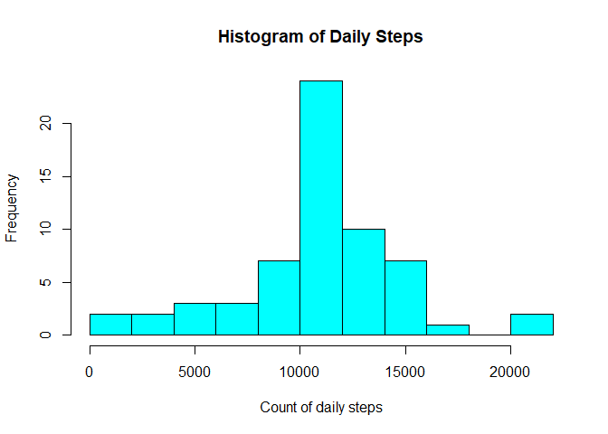
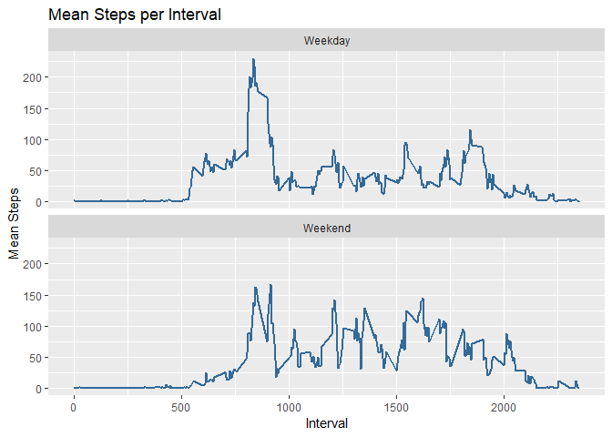

## Loading and preprocessing the data


```r
suppressPackageStartupMessages(library(dplyr))
suppressPackageStartupMessages(library(ggplot2))
suppressPackageStartupMessages(library(lubridate))

# unzip and read files
unzip("activity.zip", overwrite = TRUE)
dsactivity <- tbl_df(read.csv("activity.csv"))
```

## What is mean total number of steps taken per day?

A little processing with dplyr:

```r
dailysteps <- dsactivity[complete.cases(dsactivity),] %>% 
        group_by(date) %>% 
        summarize(sum(steps))

names(dailysteps) <- c("date", "daily_steps")
```

Let's see what the histogram of daily steps look like in our sample.

```r
with(dailysteps, hist(daily_steps, col = 5, breaks = 11, main = "Histogram of Daily Steps", xlab = "Count of daily steps"))
```

<!-- -->

And we can obtain the mean and median measures for the number of steps taken each day.

```r
mean(dailysteps$daily_steps)
```

```
## [1] 10766.19
```

```r
median(dailysteps$daily_steps)
```

```
## [1] 10765
```

## What is the average daily activity pattern?
Let's see how the average daily activity pattern looks like.

```r
steps_per_interval <- dsactivity[complete.cases(dsactivity),] %>% 
        group_by(interval) %>% 
        summarize(mean(steps))
names(steps_per_interval) <- c("interval", "mean_steps")

plot <- ggplot(steps_per_interval, aes(interval, mean_steps, colour = 2))
plot + geom_line(lwd = 1) + labs(x = "Interval", y = "Mean Steps", title = "Mean Steps per Interval") + guides(colour = FALSE)
```

<!-- -->

The maximum average mean of steps occurs on interval 835.

```r
as.data.frame(filter(steps_per_interval, mean_steps == max(mean_steps)))
```

```
##   interval mean_steps
## 1      835   206.1698
```

## Imputing missing values

Let's have a look on how many missing values there are in our data set. We know there are no missing values on columns 2 and 3 (date and interval), which makes a lot of sense.

```r
length(which(!complete.cases(dsactivity)))
```

```
## [1] 2304
```

So we have to substitute the 2,304 NA values in our sample. For now, let's use the mean count of steps for each specific interval across all days. This will substitute the NA values and create a new data set.

```r
fill <- dsactivity[complete.cases(dsactivity),] %>% 
        group_by(interval) %>% 
        summarize(round(mean(steps), 1))
names(fill) <- c("interval", "fill")

dsactivity2 <- dsactivity %>% 
        left_join(fill, by = "interval") %>% 
        mutate(steps = ifelse(is.na(steps), fill, steps)) %>% 
        select(steps, date, interval)
```

We can see that this new inputs didn't significantly change the daily mean and median of of the variable steps we exposed earlier.

```r
dailysteps2 <- dsactivity2[complete.cases(dsactivity2),] %>% 
        group_by(date) %>% 
        summarize(sum(steps))

names(dailysteps2) <- c("date", "daily_steps")

mean(dailysteps2$daily_steps)
```

```
## [1] 10766.19
```

```r
median(dailysteps2$daily_steps)
```

```
## [1] 10766.2
```

The histogram of daily steps with the missing values filled looks like this:

```r
with(dailysteps2, hist(daily_steps, col = 5, breaks = 11, main = "Histogram of Daily Steps", xlab = "Count of daily steps"))
```

<!-- -->

## Are there differences in activity patterns between weekdays and weekends?

Let's start identifying weekdays and weekends on our data set. I'm using R in Portuguese, which is my native language. You'll probably have to adapt this code chunk for your language - in Portuguese, "sáb" is abbreviation for "Saturday" and "dom" is abbreviation for "Sunday".

```r
dsactivity2 <- dsactivity2 %>% 
        mutate(weekday = weekdays(ymd(date), abbreviate = TRUE)) %>% 
        mutate(weekday = as.factor(ifelse(weekday == "sáb" | weekday == "dom", "Weekend", "Weekday")))
```

From now on, we're not suppose to face any issues with translation. Now we can group the data by weekday and weekend and get the mean steps taken per interval.

```r
patterns <- dsactivity2 %>% 
        group_by(weekday, interval) %>% 
        summarize(mean_steps = mean(steps))
```

Finally, let's look at this data in a more friendly way.

```r
plot <- ggplot(patterns, aes(interval, mean_steps, colour = 2))
plot + geom_line(lwd = 1) + facet_wrap(weekday ~ ., nrow = 2) + labs(x = "Interval", y = "Mean Steps", title = "Mean Steps per Interval") + guides(colour = FALSE)
```

<!-- -->
